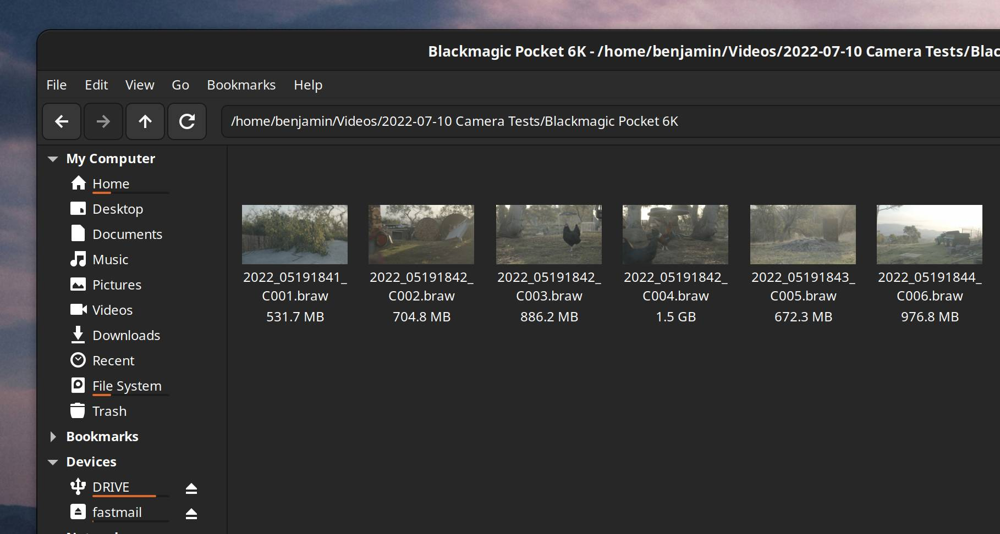
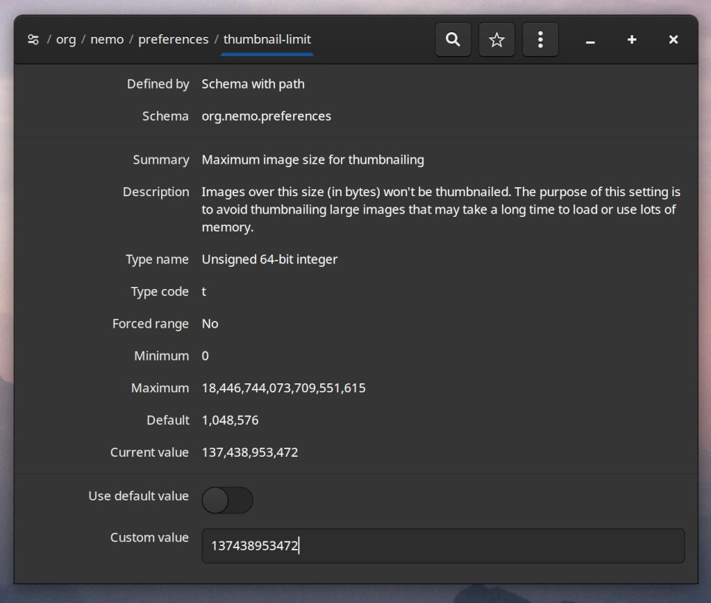

# Blackmagic RAW Thumbnailer
Add .BRAW thumbnail generation to Linux (currently only tested on Fedora 40).


---

## Installation

### Building
Install the depedencies (based on Fedora 40):
```sh
sudo dnf install gcc-c++ make ImageMagick-c++-devel pkgconfig
```

Make sure you have:
- DaVinci Resolve installed
OR
- [Blackmagic RAW SDK](https://www.blackmagicdesign.com/au/products/blackmagicraw) (Installed via their included `.rpm` installer)

Then open the terminal in the directory and run `make`

### Install
To install you can then run:
```sh
sudo sh install.sh
```

This install script will:
- Check to see if you have the DaVinci Resolve installed OR the Blackmagic SDK libraries (At either `/usr/lib/` or `/usr/lib64/` + `blackmagic/BlackmagicRAWSDK/Linux/Libraries`)
- If you have Resolve installed, it will copy the required libraries to `/usr/lib/blackmagic/BlackmagicRAWSDK/Linux/Libraries`
- It will then copy braw-thumbnailer.thumbnailer to the `/usr/share/thumbnailers` folder
- And braw-thumbnailer to the `/usr/bin` folder

> It is also possible to install these files _without sudo_, you can manually install them to `~/.local/share/thumbnailers` and `~/bin` respectively - however, if the Blackmagic RAW SDK libraries are not available in one of the `/usr/lib` directories mentioned above you may have issues with some file managers (such as nautilus, as I've discovered [thanks to a post by Oscar](https://askubuntu.com/questions/1235054/ffmpegthumbnailer-command-works-but-nautilus-failed-to-genereate-thumbnails)).

Close your file manager and then open up again and you should be seeing thumbnails on BRAW files.

## Enabling Previews
Make sure that your file manager is set to show previews.

### Dolphin
In **Dolphin** you'll need to go to _Configure_ -> _Configure Dolphin_ settings and under _Previews_ enable _Blackmagic RAW Clip_. You may also want to change 'Remote storage: Show previews for' to something relatively large if you work off remote storage.

### Nemo (Cinnamon Files)
In **Nemo** you'll need to go to File -> Preferences and then Preview and ensure that _'Show thumbnails'_ is on and _'Only for files smaller than'_ is set to something large... we all know how big BRAW files can get.

If you have footage that is large than 64GB _(I know I do...)_ you can modify the settings further using a tool called `dconf-editor`:


We can push past Nemo's 64GB limit by setting `/org/nemo/preferences/thumbnail-limit` to `137438953472` bytes, approximately 128 GB. 
But be aware that this will not show up in the user interface, it will look like it has been set back to 1MB even though it hasn't.

### Nautilus (GNOME Files)
In **Nautilus**, just like in Nemo, if you're using network-attached storage you may want to open _Preferences_ and set `'Show Thumbnails'` to `All Files`.

And you might need to use `dconf-editor` to change the thumbnail file size limit by setting 
`/org/gnome/nautilus/preferences/thumbnail-limit` to `128000` (approx 128 GB, Nautilus uses megabytes instead of bytes for this value)

## Clearing thumbnail cache
You may also need to clear the thumbnails cache in order to get them to load:
```sh
sh clear_thumbnails_cache.sh
```

## Debugging
I have no idea what I'm doing. There's apparently some debugger stuff in the code but no idea how to activate that.

If you want to debug why thumbnails aren't working these are some commands that may help.
```sh
# This one apparently does something
sudo journalctl | grep BRAWThumbnailer

# This one also apparently does something
G_MESSAGES_DEBUG=all nautilus
```

---

## Changelog
v0.1.1
- Added a fallback to `/opt/resolve/libs` so that non-root users who aren't using nautilus can still use it.

v0.1
- First release